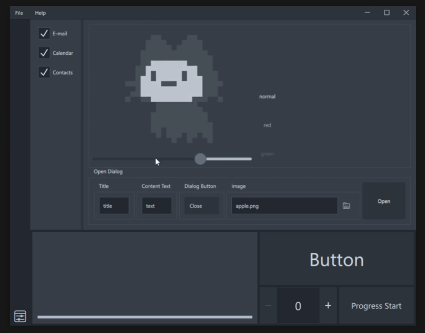
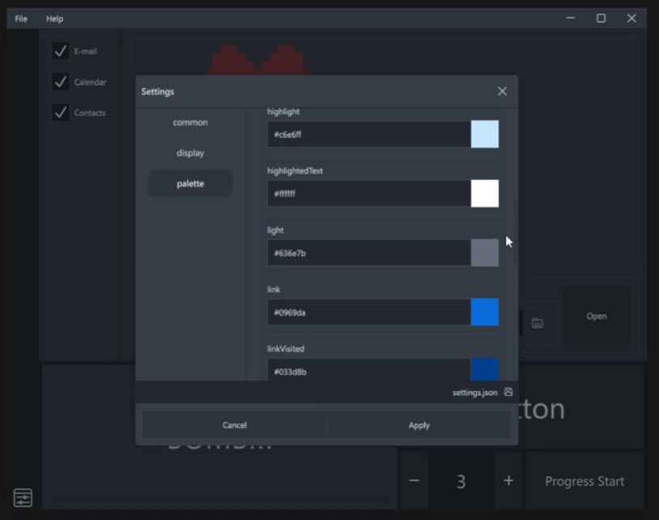

  
An example of a simple Qml app that styles with a theme.

---

- async python backend
- Custom title bar
- window drop shadow (test)
- Custom dialog
- Dynamic settings (json base)
- Dynamic color theme (json base)
- drawer menu (supports left, right, top, bottom)

---



## App settings

[settings.json](app/settings.json)



## Convert resource.qrc to resource.py

```
pipenv run qrc_convert
```

## Run

```
pipenv run run
```

debug mode

```
pipenv run_debug
```

## Build

[build.sh](build.sh)

```
python -m nuitka \
        --follow-imports \
        --onefile \
        --windows-icon-from-ico=app/resource/icon/app.ico \
        --plugin-enable=pyside6 \
        --include-qt-plugins=platforms,qml,imageformats,tls \
        --include-data-file=app/*.json=./app/ \
        --include-data-file=app/.env=./app/ \
        --include-data-file=app/apple.png=./app/ \
        --include-data-dir=app/qml=./app/qml \
        --include-data-dir=app/backend=./app/backend \
        --include-module=dotenv \
        --output-dir=build/app \
        run.py
```

or

```
pipenv run build
```

---

> ### Referenced color
>
> [primer.style / primitives / colors](https://primer.style/primitives/colors)
